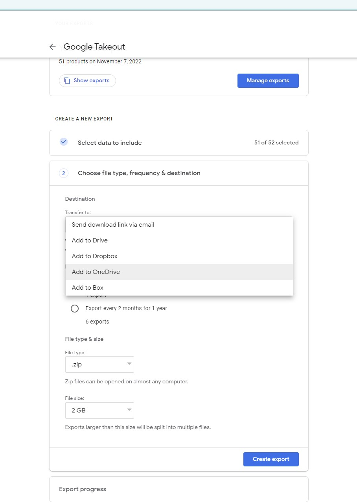
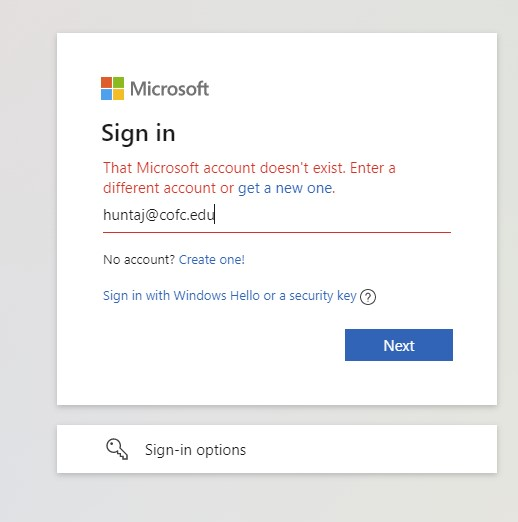
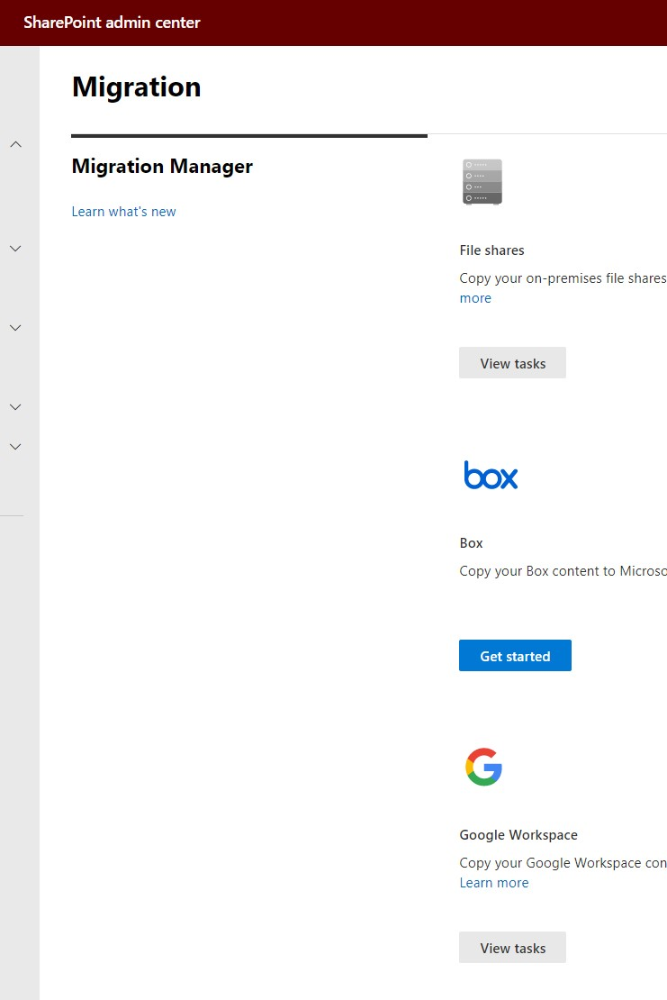

# Google to SharePoint Migration Assistant (Python)

Multithreaded, configurable, automated migration assistant for migrating files out of Google Drive into SharePoint. Built for a Vanderbilt University CS 6387 Topics in SWE: Security final project. Contextualized and tested with College of Charleston's enterprise level file migration in light of new Google-enforced storage quotas. Set up a Google project and a SharePoint application for authentication on both sides, and then simply define a JSON-formatted map from the Google source location(s) to the respective SharePoint target location(s), then run it and sip your coffee.

Also building with the option of deploying an enterprise web application allowing users to trigger these migrations themselves. I personally tried using Google's built-in Google Takeout integration for OneDrive on my CofC Google Account huntaj@g.cofc.edu and this did not work because the tool is not set up to recognize OneDrive for Business accounts. Screenshots below demonstrate this issue.

First, I chose the OneDrive option when configuring Google Takeout.



Then, I received an error message stating that my account doesn't exist, as it's a OneDrive for Business account created as a member of the CofC organization.



## Why build this?

We first attempted couple of large scale (approx 5 TB total) data migrations using the official [SharePoint Migration Manager for Google Workspace](https://docs.microsoft.com/en-US/sharepointmigration/mm-google-overview?WT.mc_id=365AdminCSH_spo). This tool comes with a nice web UI and the ability to run a read-only scan and then copy that scan over into a migrations list where it can then be queued up and run as a full migration. After running this tool with a couple of different use cases, we started hitting obstacles with the reporting. Specifically, certain files (files that are supposed to be migratable like images and documents) were being skipped despite the migration logs confirming successul migrations for those items. So, since the reporting was not accurately reporting the errors, we needed a tool for migrating data that produced accurate, detailed logging, that we could rely on.


Moreover, we are not heavily staffed and having a way for users to self-enqueue their own file migrations would offload a load of effort from the central team. Having an organization-wide web app that offers users the ability to authorize and queue their own migrations from Google to OneDrive or SharePoint -- and view logs of those migrations themselves that they can provide if/when they request support -- would be a step up from having to manage all migrations centrally ourselves.

## Overview

The project takes your provided JSON-formatted migration map (i.e. mapping sources in Google to destinations in SharePoint), and does the following for each migration in the JSON array:

1. Builds an in-memory tree of the full Google drive source
2. Using the in-memory tree, downloads a configurable-size batch of files from Google source with multithreading
3. Triggers a SharePoint uploader to upload (with multithreading) that new batch of downloaded files to the specified target/destination SharePoint site's document library (with optional base folder)
4. Removes the local files after SharePoint Uploader has finished its upload process
5. Starts back over at step 2 with a new configurable-size batch of files that have not yet been downloaded

Example JSON map: [src/map.json](src/map.json)

## Need for Speed

This project leverages Python multithreading via the [ThreadPoolExecutor](https://docs.python.org/3/library/concurrent.futures.html#threadpoolexecutor) class from the [concurrent.futures](https://docs.python.org/3/library/concurrent.futures.html#threadpoolexecutor) package which offers a significant performance improvement over the previously attempted single-threaded approach for both downloading and uploading. In order to make interaction with the Google Drive v3 API thread-safe, I implemented the instructions found [here](https://github.com/googleapis/google-api-python-client/blob/main/docs/thread_safety.md). I didn't have to do anything special to make the SharePoint uploading thread-safe.

## Authentication & Authorization

Authenticating against Google can be done one of two ways:

1. With a [service account](https://cloud.google.com/iam/docs/service-accounts) (which I recommend). This requires that the service account be granted access to each drive/folder being migrated ahead of the migration. You can do this by getting the data owner to Share the folder with the email address of the service account once you create one.
2. With OAuth InstalledAppFlow. In this case, the app runs on behalf of a user and leverages the signed in user's access to the data to be migrated. Requires the user to be involved in the migration process. Also requires that you run the assistant in an environment that can open a web browser, since a web browser is needed for you to sign into your Google Account and grant access to the application.

### Google OAuth

For the Google OAuth option implementation, I followed [these steps](https://developers.google.com/drive/api/quickstart/python) (another good resource is [here on stack overflow](https://stackoverflow.com/questions/60111361/how-to-download-a-file-from-google-drive-using-python-and-the-drive-api-v3)) which walk through using the Google Cloud Platform to create a project with the Drive v3 API enabled, setting up credentials, and downloading those credentials as a JSON file that can be used for authentication.

Once you have downloaded your credentials JSON file, copy the content of that JSON and flatten it all into a single line, then paste it as the value of the `GOOGLE_DRIVE_OAUTH_CREDS` in your `.env` file (copied from the [`.env-template`](src/.env-template) file provided in the src directory. )

Doing it this way allows the centralization of the secret stuff; no need for a separate credentials.json vulnerability being stored in the project.

As a side note, your credentials JSON should have the following structure:

```
{
  "web": {
    "client_id": "XXXXXXXXXX-XXXXXXXXXXXXXXXXXXXXXXXXXXXXXXXX.apps.googleusercontent.com",
    "project_id": "some-project-XYZABC",
    "auth_uri": "https://accounts.google.com/o/oauth2/auth",
    "token_uri": "https://oauth2.googleapis.com/token",
    "auth_provider_x509_cert_url": "https://www.googleapis.com/oauth2/v1/certs",
    "client_secret": "XXXXXXXXXXXXXXXXXXXXXXXXX-YYYYYYY",
    "redirect_uris": ["http://localhost:8080"],
    "javascript_origins": ["http://localhost:8080"]
  }
}
```

and after flattening it for the `.env` file value, should look like:

```
GOOGLE_DRIVE_OAUTH_CREDS={"web": {"client_id": "XXXXXXXXXX-XXXXXXXXXXXXXXXXXXXXXXXXXXXXXXXX.apps.googleusercontent.com","project_id": "some-project-XYZABC","auth_uri": "https://accounts.google.com/o/oauth2/auth","token_uri": "https://oauth2.googleapis.com/token","auth_provider_x509_cert_url": "https://www.googleapis.com/oauth2/v1/certs","client_secret": "XXXXXXXXXXXXXXXXXXXXXXXXX-YYYYYYY","redirect_uris": ["http://localhost:8080"],"javascript_origins": ["http://localhost:8080"]}}
```

### Google Service Account

This is honestly the better option in my opinion, as I'm a big fan of automation. OAuth flow is a bit more manual and requires direct user sign in & granting of access, but a service account can be fully prepped ahead of time. To implement the service account authentication option for the project, I basically just followed [these simple instructions from Ben James](https://blog.benjames.io/2020/09/13/authorise-your-python-google-drive-api-the-easy-way/).

### SharePoint Upload

The SharePoint Uploader uses [the SharePoint App-Only permission model](https://docs.microsoft.com/en-us/sharepoint/dev/solution-guidance/security-apponly-azureacs) to authenticate against SharePoint and manage file uploads. I followed the instructions in the linked article to create the client ID and client secret for the SharePoint Uploader application. These are respectively stored in the `SHAREPOINT_APP_CLIENT_ID` and `SHAREPOINT_APP_CLIENT_SECRET` environment variables loaded in from the `.env` file which you need to populate with your own values (by copying [`.env-template`](src/.env-template) to your own `.env` file first) in order to run the project.

## Mapping Sources to Destinations

To provide a map of your migration sources and destinations, use a `map.json` file stored in the [src](src/__init__.py) directory. The `map.json` file should have this structure:

```
[ # list of migrations to complete
    # first migration
    {
        "google_source_name": "CSD Staff", # name of the source in Google being migrated
        "google_source_type": "shared_drive", # type of the source in Google being migrated to SharePoint
        "local_temp_dir": "CSD Staff", # directory to temporarily store files on local machine during migration
        "target_sharepoint_site": "https://cofc.sharepoint.com/sites/hub-training", # site to which files are being migrated
        "target_document_library": "Shared Documents", # document library to which files are being migrated (on the target site above); must be created already
        "target_folder": "General",  # folder within the above document library to which files should be migrated. can be empty string if you want them to live in the base of the document library.
        "notify_stakeholders": [
            {"name": "Austin", "email" : "huntaj@cofc.edu"} # list of stakeholders who should be notified about the completion of the migration. can be an empty array, i.e. []
        ],
        "cc_emails": [
            "austin353@gmail.com" # list of emails that should be CC'd on the notification email after migration runs.
        ],
        "file_batch_size": 100, # how many files should be processed (downloaded to local disk) at one time? If you are dealing with large files (e.g. RAW image files), you should make this a lower value especially if running on a server with small disk space)
        "verbose": true, # whether you want to use verbose logging.
        "wait_for_confirmation_before_migrating": true # whether to prompt for confirmation about the source to be migrated before migrating. If set to false, no confirmation prompt will show up and migration will just happen. If you have a full list of migrations to run overnight, false could be beneficial otherwise it will stop and wait until you wake up to confirm the next one.
    },

    {...}, # another migration

    {...}, # another migration

    {...}, # another migration
]
```

## Running

Once you have copied the `.env-template` file to your own `.env` file and have populated the environment variables with your own unique values, and you have your `map.json` file set up with your own migration maps (as defined above), you can run the project with

```
python migrationassistant.py
```

This will log both to standard output and to log files in a created `migration-logs` directory.
