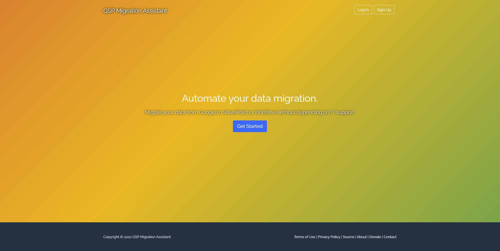

# Google to SharePoint Migration Assistant (Python)

This is a multithreaded, configurable, automated migration assistant for migrating files out of Google Drive into SharePoint Online or OneDrive for Business. It was built for a Vanderbilt University CS 6387 Topics in SWE: Security final project. The context for the project was College of Charleston's enterprise level file migration in light of new Google-enforced storage quotas starting in 2022. This is a problem that also affects a number of other universities, as seen in [these Google query results for `site:edu "google storage" "change" "data" "limit"`](https://www.google.com/search?q=site%3Aedu+%22google+storage%22+%22change%22+%22data%22+%22limit%22&oq=site%3Aedu+%22google+storage%22+%22change%22+%22data%22+%22limit%22+&aqs=chrome..69i57j69i58.11364j0j9&sourceid=chrome&ie=UTF-8)

This project started out with simple service-account based authentication without a web app, meaning some admin would have had to manually set up migrations for functional users, run them, monitor them, etc. I wanted to build something that could offload that responsibility to the functional user such that they could grant the application access to their data and start their own migration without (or with minimal) IT involvement. In other words, I wanted to build an app that used OAuth and [OpenID Connect](https://openid.net/specs/openid-connect-core-1_0.html) to perform migration operations on behalf of a signed in user. 

With the service account approach, an admin would set up a Google project and a SharePoint application for authentication on both sides, and then define a JSON-formatted map (example in [map.json](src/map.json)) from the Google source location(s) to the respective SharePoint target location(s), then run it and sip their coffee.

Before kicking off, I personally tried using Google's built-in Google Takeout integration for OneDrive on my CofC Google Account huntaj@g.cofc.edu and this did not work because the tool is not set up to recognize OneDrive for Business accounts. Screenshots below demonstrate this issue.

First, I chose the OneDrive option when configuring Google Takeout.


Then, I received an error message stating that my account doesn't exist, as it's a OneDrive for Business account created as a member of the CofC organization.


## Why build this?

We first attempted couple of large scale (approx 5 TB total) data migrations using the official [SharePoint Migration Manager for Google Workspace](https://docs.microsoft.com/en-US/sharepointmigration/mm-google-overview?WT.mc_id=365AdminCSH_spo). This tool comes with a nice web UI and the ability to run a read-only scan and then copy that scan over into a migrations list where it can then be queued up and run as a full migration. After running this tool with a couple of different use cases, we started hitting obstacles with the reporting. Specifically, certain files (files that are supposed to be migratable like images and documents) were being skipped despite the migration logs confirming successul migrations for those items. So, since the reporting was not accurately reporting the errors, we needed a tool for migrating data that produced accurate, detailed logging that we could rely on.


Moreover, we are not heavily staffed and having a way for users to self-enqueue their own file migrations would offload a significant amount of work from the central team. Having an organization-wide web app that offers users the ability to authorize and queue their own migrations from Google to OneDrive or SharePoint -- and view logs of those migrations themselves that they can provide if/when they request support -- would be a step up from having to manage all migrations centrally ourselves. Plus, central management also means more of a bottleneck, which means more waiting for the functional users. 

## Need for Speed

This project leverages Python multithreading via the [ThreadPoolExecutor](https://docs.python.org/3/library/concurrent.futures.html#threadpoolexecutor) class from the [concurrent.futures](https://docs.python.org/3/library/concurrent.futures.html#threadpoolexecutor) package which offers a significant performance improvement over the previously attempted single-threaded approach for both downloading and uploading. In order to make interaction with the Google Drive v3 API thread-safe, I implemented the instructions found [here](https://github.com/googleapis/google-api-python-client/blob/main/docs/thread_safety.md). I didn't have to do anything special to make the SharePoint uploading thread-safe.

## Without a Web App - the JSON-Driven Scripted Approach 

The project takes your provided JSON-formatted migration [map](src/map.json) (i.e. mapping sources in Google to destinations in SharePoint), and does the following for each migration in the JSON array:

1. Builds an in-memory tree of the full Google drive source
2. Using the in-memory tree, downloads a configurable-size batch of files from Google source with multithreading
3. Triggers a SharePoint uploader to upload (with multithreading) that new batch of downloaded files to the specified target/destination SharePoint site's document library (with optional base folder)
4. Removes the local files after SharePoint Uploader has finished its upload process
5. Starts back over at step 2 with a new configurable-size batch of files that have not yet been downloaded

## Authentication & Authorization

Authenticating against Google can be done one of two ways:

1. With a [service account](https://cloud.google.com/iam/docs/service-accounts) (which I recommend). This requires that the service account be granted access to each drive/folder being migrated ahead of the migration. You can do this by getting the data owner to Share the folder with the email address of the service account once you create one. The 
2. With OAuth InstalledAppFlow. In this case, the app runs on behalf of a user and leverages the signed in user's access to the data to be migrated. Requires the user to be involved in the migration process. Also requires that you run the assistant in an environment that can open a web browser, since a web browser is needed for you to sign into your Google Account and grant access to the application. Google's OAuth 2.0 flow conforms to the Open ID Connect specification, meaning it can be used for both authentication and authorization. 

### Google OAuth

For the Google OAuth option implementation, I followed [these steps](https://developers.google.com/drive/api/quickstart/python) (another good resource is [here on stack overflow](https://stackoverflow.com/questions/60111361/how-to-download-a-file-from-google-drive-using-python-and-the-drive-api-v3)) which walk through using the Google Cloud Platform to create a project with the Drive v3 API enabled, setting up credentials, and downloading those credentials as a JSON file that can be used for authentication.

Once you have downloaded your credentials JSON file, copy the content of that JSON and flatten it all into a single line, then paste it as the value of the `GOOGLE_DRIVE_OAUTH_CREDS` in your `.env` file (copied from the [`.env-template`](src/.env-template) file provided in the src directory. )

Doing it this way allows the centralization of the secret stuff; no need for a separate credentials.json vulnerability being stored in the project.

As a side note, your credentials JSON should have the following structure:

```
{
  "web": {
    "client_id": "XXXXXXXXXX-XXXXXXXXXXXXXXXXXXXXXXXXXXXXXXXX.apps.googleusercontent.com",
    "project_id": "some-project-XYZABC",
    "auth_uri": "https://accounts.google.com/o/oauth2/auth",
    "token_uri": "https://oauth2.googleapis.com/token",
    "auth_provider_x509_cert_url": "https://www.googleapis.com/oauth2/v1/certs",
    "client_secret": "XXXXXXXXXXXXXXXXXXXXXXXXX-YYYYYYY",
    "redirect_uris": ["http://localhost:8000"],
    "javascript_origins": ["http://localhost:8000"]
  }
}
```

and after flattening it for the `.env` file value, should look like:

```
GOOGLE_DRIVE_OAUTH_CREDS={"web": {"client_id": "XXXXXXXXXX-XXXXXXXXXXXXXXXXXXXXXXXXXXXXXXXX.apps.googleusercontent.com","project_id": "some-project-XYZABC","auth_uri": "https://accounts.google.com/o/oauth2/auth","token_uri": "https://oauth2.googleapis.com/token","auth_provider_x509_cert_url": "https://www.googleapis.com/oauth2/v1/certs","client_secret": "XXXXXXXXXXXXXXXXXXXXXXXXX-YYYYYYY","redirect_uris": ["http://localhost:8000"],"javascript_origins": ["http://localhost:8000"]}}
```

### Google Service Account

This is honestly the better option in my opinion, as I'm a big fan of automation. OAuth flow is a bit more manual and requires direct user sign in & granting of access, but a service account can be fully prepped ahead of time. To implement the service account authentication option for the project, I basically just followed [these simple instructions from Ben James](https://blog.benjames.io/2020/09/13/authorise-your-python-google-drive-api-the-easy-way/).

### SharePoint Upload

The SharePoint Uploader uses [the SharePoint App-Only permission model](https://docs.microsoft.com/en-us/sharepoint/dev/solution-guidance/security-apponly-azureacs) to authenticate against SharePoint and manage file uploads. I followed the instructions in the linked article to create the client ID and client secret for the SharePoint Uploader application. These are respectively stored in the `SHAREPOINT_APP_CLIENT_ID` and `SHAREPOINT_APP_CLIENT_SECRET` environment variables loaded in from the `.env` file which you need to populate with your own values (by copying [`.env-template`](src/.env-template) to your own `.env` file first) in order to run the project.

## Mapping Sources to Destinations

To provide a map of your migration sources and destinations, use a `map.json` file stored in the [src](src/__init__.py) directory. The `map.json` file should have this structure:

```
[ # list of migrations to complete
    # first migration
    {
        "google_source_name": "CSD Staff", # name of the source in Google being migrated
        "google_source_type": "shared_drive", # type of the source in Google being migrated to SharePoint
        "local_temp_dir": "CSD Staff", # directory to temporarily store files on local machine during migration
        "target_sharepoint_site": "https://cofc.sharepoint.com/sites/hub-training", # site to which files are being migrated
        "target_document_library": "Shared Documents", # document library to which files are being migrated (on the target site above); must be created already
        "target_folder": "General",  # folder within the above document library to which files should be migrated. can be empty string if you want them to live in the base of the document library.
        "notify_stakeholders": [
            {"name": "Austin", "email" : "huntaj@cofc.edu"} # list of stakeholders who should be notified about the completion of the migration. can be an empty array, i.e. []
        ],
        "cc_emails": [
            "austin353@gmail.com" # list of emails that should be CC'd on the notification email after migration runs.
        ],
        "file_batch_size": 100, # how many files should be processed (downloaded to local disk) at one time? If you are dealing with large files (e.g. RAW image files), you should make this a lower value especially if running on a server with small disk space)
        "verbose": true, # whether you want to use verbose logging.
        "wait_for_confirmation_before_migrating": true # whether to prompt for confirmation about the source to be migrated before migrating. If set to false, no confirmation prompt will show up and migration will just happen. If you have a full list of migrations to run overnight, false could be beneficial otherwise it will stop and wait until you wake up to confirm the next one.
    },

    {...}, # another migration

    {...}, # another migration

    {...}, # another migration
]
```

## Environment Variables / Secrets

To avoid including secret values in the repository while still allowing for the possibility of collaboration on a fairly large scale project, I've written [lastpass-pull-env.py](lastpass-pull-env.py) that uses the LastPass SDK to pull the contents of a (possibly shared) secure note into a local .gitignored .env file. To use this approach, store the note as `.env` inside a specific folder, e.g., "GITIGNORED\googleproject". Run the script, authenticate, and provide that folder path.

## Running the Migration Script with map.json

Once you have populated the environment variables with your own unique values, and you have your `map.json` file set up with your own migration maps (as defined above), you can run the project with

```
python migrationassistant.py
```

This will log both to standard output and to log files in a created `migration-logs` directory.

# The Django Web App



## Models

The following models are used by this web application:

- Profile (extension of the default User model via a one-to-one map; this is common with Django projects).
- Migration. We obviously want to provide users and admins with the ability to view a record of completed migrations. Users should be able to see their own migrations, and admins should be able to see all migrations. Each migration is tied to the User that triggered it via foreign key mapping to the User model. Migration objects are to be created when the migration is triggered. Upon completion, attributes related to the amount of data migrated and the amount of time it took to complete are updated.
- AdministrationSettings. This model allows for application admins to use the admin dashboard to configure the connection with Google and SharePoint rather than having to place a credentials JSON file into the project itself.

## Usage

1. Get started, brings you to Create Migration page.
2. Log into Google, authorize migration app via Google OAuth.
3. Log into O365, authorize migration app via Azure App Registration OAuth.
4. Select one Google source file/folder/shared drive.
5. Select one SharePoint / OneDrive destination.
6. Enqueue migration.
7. View activity of migration as it is happening. Able to see if it has started. If using a queue (not decided on implementation yet), display how many migration jobs are ahead of your own. IDEAL: trigger migration would spin up a new AWS lambda for running migration process along with new EC2 instance for housing the intermediary files since they need to be first downloaded before reuploading to destination.


## Running Locally & Developing
0. Install requirements with `pip install -r requirements.txt`
1. Install [Redis](https://redis.io/docs/getting-started/installation/). 
2. Set up the database with `python manage.py makemigrations && python manage.py migrate`
3. Create a superuser `python manage.py createsuperuser`. Fill out the prompts. This is a user that will have access to the admin view. I recommend not using a username that matches your organization userPrincipalName (e.g. use something like 'admin' rather than 'myrealusername@myorganization.edu'). 
4. In a terminal window, start a Redis server with `redis-server`. 
5. In another terminal window, set up Sass. `cd` into the `style` directory. `cd GoogleSharePointMigrationAssistant/web/static/style`
   1. `sass --watch main.scss:main.css`. This command will automatically detect changes to the .scss files and compile all of them into main.css, which is the main CSS file used by the web app. 
6. In another terminal window, set up a Celery worker. This will be responsible for asynchronous task execution (e.g. scanning and migrating) so the user doesn't have to wait for these things to finish before getting a response: `python -m celery -A GoogleSharePointMigrationAssistant worker`
7. Now, in another terminal window, run the Django web server. `python manage.py runserver`. This will start the web server on port 8000, which you can access with [https://localhost:8000](https://localhost:8000) in a web browser. 
8. Go to [https://localhost:8000/admin](https://localhost:8000/admin), log in with your superuser account. Create a new "AdministrationSettings" object. Populate the fields as desired to set up connections with your Google OAuth client, Azure AD app registration, SMTP server, Twilio messaging service, etc. 
9. Save those changes. Then, either log out or open a new incognito browser window, then try logging in using the O365 / Single-Sign-On option, and use your O365 account. This should allow you to log in to the application via O365 SSO, and it should create a new user for you with a local username and email matching the userPrincipalName of your identity in Azure AD. The local password is randomly initialized; you will not be logging in locally so there is no need to remember or store a password. Since this is the first time you are logging in, you should get prompted to authorize this app to access to some of your O365 data. If you approve, grant access. (If you don't, this app will not work.)
10. You'll see a button prompting you to log into Google and authorize this app to access (read only) your Google data. Click that. If you approve, grant access. (If you don't, this app will not work.)
11. After this point, the app will guide you through selecting a source and destination, then scanning, then starting the migration. 